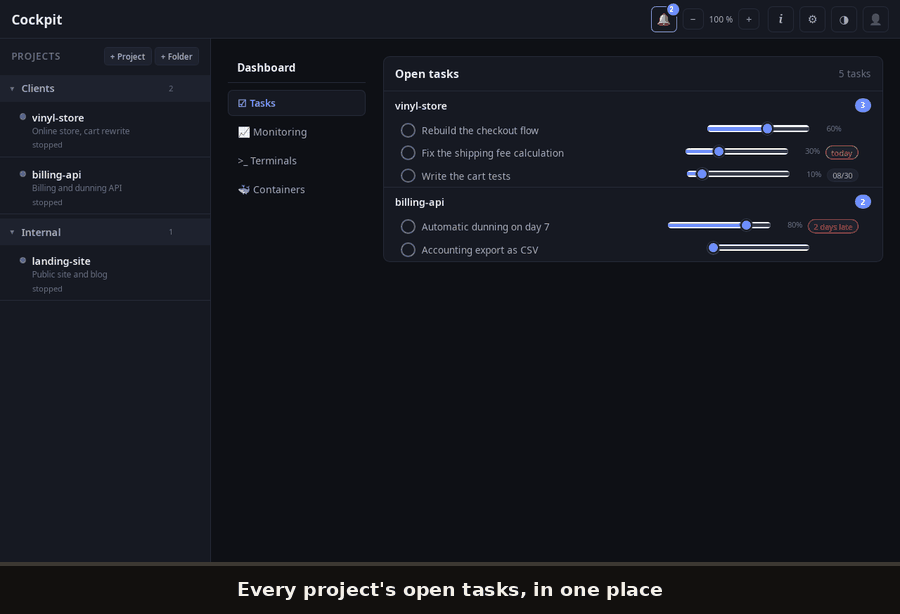
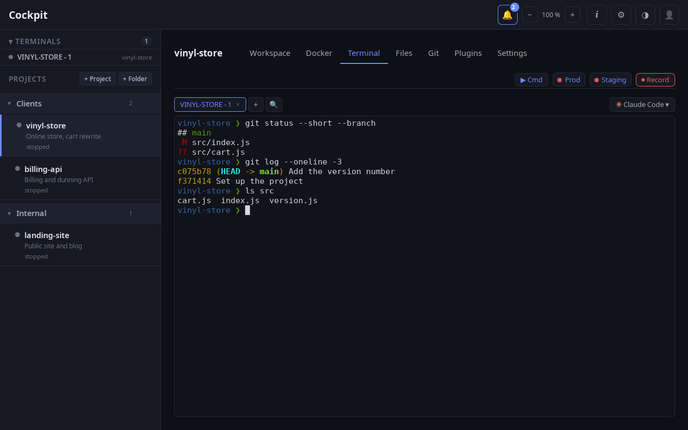
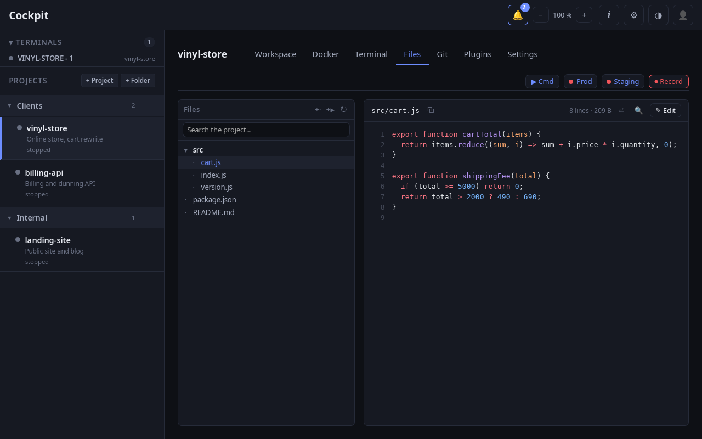
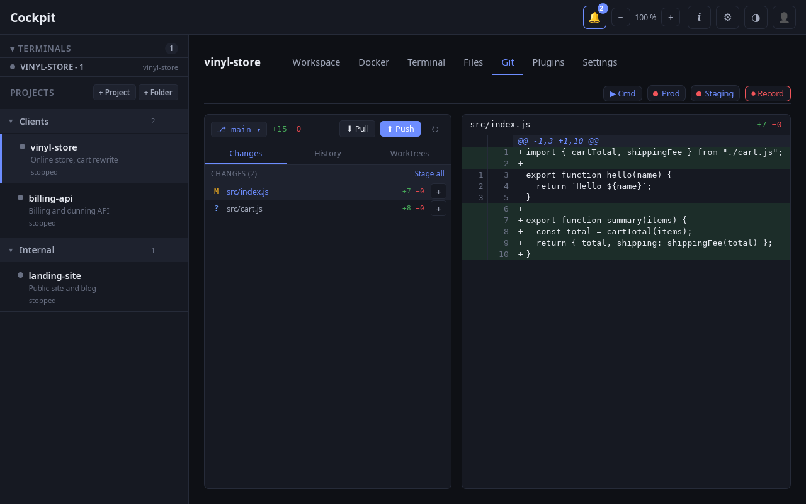

<h1 align="center">Cockpit</h1>

<p align="center">
  <strong>One place to run all your projects.</strong><br>
  Persistent terminals, files, Git, containers, notes, monitoring —<br>
  everything around a project, in a single native app.
</p>

<p align="center">
  <a href="https://cockpitdesktop.com"><strong>cockpitdesktop.com</strong></a> ·
  <a href="https://cockpitdesktop.com/#telecharger">Download</a> ·
  <a href="CHANGELOG.md">Changelog</a>
</p>

<p align="center">
  <a href="https://cockpitdesktop.com"></a>
  <a href="https://github.com/jguevel-tech/cockpit/releases/latest"></a>
  <a href="https://github.com/jguevel-tech/cockpit/actions/workflows/release.yml"></a>
  
  <a href="LICENSE"></a>
</p>

<p align="center">
  
</p>

---

## Install

Every platform's installer is on **[cockpitdesktop.com](https://cockpitdesktop.com/#telecharger)**,
which reads them straight from the release below — same files, one page, with their sizes.

### Linux

```sh
curl -fsSL https://raw.githubusercontent.com/jguevel-tech/cockpit/main/scripts/install.sh | sh
```

That's it. The script installs the latest release into `~/.local/bin`, adds a desktop entry, and
needs no root privileges. Then run `cockpit`.

### macOS (beta, Apple Silicon)

Download the `.dmg` from the [releases page](https://github.com/jguevel-tech/cockpit/releases/latest),
drag Cockpit to Applications.

The app is not notarized by Apple yet, so the first launch is refused. **Right-click → Open no
longer works** — Apple removed that shortcut in macOS 15. Two cases:

- macOS says it *"cannot verify this app is free of malware"* → click **Cancel** (not *Move to
  Trash*), then open **System Settings → Privacy & Security**, scroll to the message about
  Cockpit and click **Open Anyway**.
- macOS says the app *"is damaged and cannot be opened"* → no button will help. Run
  `xattr -d com.apple.quarantine /Applications/Cockpit.app` in a terminal, then open it normally.

Updates afterwards need none of this: the in-app updater downloads them itself, and macOS only
quarantines what comes from a browser.

> **Updates happen inside the app** on both platforms. When a new version ships, a bell appears in
> the header: one click shows what changed and installs it. You won't need to download anything again.

### Windows (first release)

Download the `.exe` installer from the
[releases page](https://github.com/jguevel-tech/cockpit/releases/latest) and run it. Windows will
warn you that the publisher is unknown — the app is not signed with a paid certificate. Click
**More info**, then **Run anyway**.

This is the first Windows build ever published. The full test suite passes there, terminals
included, but nobody has yet used it for a day's work. If something is broken,
[open an issue](https://github.com/jguevel-tech/cockpit/issues/new) — that is exactly what would
help most.

<details>
<summary><strong>Other install methods</strong></summary>

<br>

**Manual AppImage** — grab the latest from the [releases page](https://github.com/jguevel-tech/cockpit/releases/latest):

```sh
chmod +x Cockpit_*_amd64.AppImage
./Cockpit_*_amd64.AppImage
```

**From source** — see [Development](#development).

</details>

### Requirements

None. Cockpit runs as-is — a project is just a name and a folder, and **persistent terminals are
built in**: Cockpit runs its own terminal service, with nothing to install.

Individual features lean on the tool they concern, and stay quietly inactive (or tell you exactly
what's missing) when it is absent:

| Tool | Unlocks |
|---|---|
| `git` | Git tab |
| `docker` + `docker compose` | containers tab |
| LSP servers (`rust-analyzer`, `intelephense`…) | go-to-definition |
| `tmux` | Claude Code teammates in split panes — that display mode is Claude Code's own, not Cockpit's terminals |
| an AI agent CLI (`claude`, `codex`, `gemini`, `ollama`…) | the agent features — pick yours in Settings → AI |

---

## Features

Press the **`i` button** in the header: the built-in, illustrated guide covers everything below
with visual examples rather than prose.

### Projects and navigation

A project is a name and a folder — nothing else is required. Group them in folders, **nested as
deep as you like**, reorder or move anything by dragging it, and rename projects, folders and
terminals with a double-click. Each project remembers the tab you left it on. `Ctrl`+`K` jumps
anywhere.

### Persistent terminals

Cockpit runs its own terminal service, in a process that outlives the window: close the app and
your shells keep running — screen and scrollback included — and you pick them back up on the next
launch. Search the scrollback (`Ctrl`+`Shift`+`F`) with highlighting and a match counter. A marker shows
which sessions have an AI agent working in them, and your project's past conversations are listed and
resumable in one click — from whichever agent you picked in Settings → AI.

Mouse selection, `Ctrl`+`C` to copy, `Ctrl`+click to open links. Nothing sits between your
keystrokes and the shell — not even our own shortcuts.



### Files and code

A file browser that respects your `.gitignore`, syntax highlighting for about thirty languages
with line numbers, image preview, and in-place editing. Create, rename and delete files from the
tree — deletion goes to the **system trash**, never `rm`.

Find in file (`Ctrl`+`F`) with highlighted matches, and project-wide search (`Ctrl`+`Shift`+`F`)
across folder names, file names and file contents. `Ctrl`+click on a symbol jumps to its
definition, using whichever LSP servers are installed — with a regex fallback when none is.



### Git

The daily loop without leaving the app: status, coloured diff, per-file staging, commit, push,
pull (fast-forward only — a button never merges behind your back), branch management, and a
commit history with the full diff of any commit.



### Containers

Start and stop Docker Compose projects in the right order — Cockpit resolves dependencies by
topological sort and detects cycles before launching anything. Per container: **live logs** and a
**shell inside it**, one click each. A global view lists every container, volume and image on the
machine, with cleanup actions. Entirely optional: a project without Docker is still a project.

### Command palette & quick commands

`Ctrl`+`K` jumps anywhere: projects, open terminals, tabs, files by name, dashboard views. Declare
your usual commands per project (`make up`, `npm run dev`…) and run them from the **▶ Cmd** button —
each in a fresh terminal.

### Tasks, notes, meetings

Per-project todos with **due dates** — the notification bell warns you when something is due, and
the alert clears itself once the task is done. Tree-organised Markdown notes with a WYSIWYG editor
and autosave — plus a **reading mode** that folds both side columns away and centres the text.

Meeting recording captures mic + system audio, transcribes it, and drops a summary note in the
project automatically. It needs nothing installed on Linux and Windows. On macOS the system-audio
tap requires a signed app, so the tracks come out silent — Cockpit says so instead of claiming it
heard nothing.

### AI providers, and agents

**Cockpit is not tied to one AI provider.** One place decides — Settings → AI — and the rest
follows: the conversations you resume from a terminal, the meeting write-ups, the agents. Each
provider declares what it can do (past conversations, subscription sign-in, writing,
transcription, plugins) and the interface only shows what exists: no button promising what your
provider cannot do.

Adding a provider takes one declaration in the app's catalogue (`src-tauri/src/llm/`), not a
rewrite. Twelve are recognised out of the box, and an agent running in any terminal is detected
whichever one it is.

For providers whose agents install as Claude Code plugins, a marketplace is available per project
(**Plugins** tab) and globally (Settings → Agents): browse, install, and keep them up to date.
Sign in with your subscription from the settings — no API key to paste.

### An account, if you want one

**Cockpit works without an account, and keeps working offline.** Syncing is an extra, never a
condition: with the server unreachable, everything behaves the same — the local database stays the
truth of this machine.

Create one from the app or on [cockpitdesktop.com](https://cockpitdesktop.com/#compte), sign in
with a password or with Google, and your projects, notes and tasks follow you to another machine.
Each machine signs out on its own, and deletions travel — they do not come back at the next round.

What does **not** travel, on purpose: project paths (they do not exist on the other machine, so a
project arrives without a folder, to be pointed at yours), terminals, and recordings in progress.

### Monitoring & alerts

CPU, detailed memory, disks, top processes — and the bell warns you when a disk is almost full or
CPU/memory stay saturated for minutes (never on a passing spike). Project quick links carry a
live up/down dot, so you see the moment staging goes down.

### Make it yours

Colour palettes, custom accent, and a wallpaper mode that turns the UI into legible frosted glass —
with dim, blur, opacity and shine all adjustable. Native zoom (`Ctrl`+scroll) that keeps terminals
pixel-sharp. One-click **database backup** from the settings.

---

## Handy shortcuts

| Action | Shortcut |
|---|---|
| Command palette | `Ctrl`+`K` |
| Find in file | `Ctrl`+`F` |
| Search project / terminal history | `Ctrl`+`Shift`+`F` |
| Go to definition | `Ctrl`+click on a symbol |
| Save the open file | `Ctrl`+`S` |
| Commit | `Ctrl`+`Enter` |
| Copy from a terminal | select with the mouse, then `Ctrl`+`C` |
| Zoom | `Ctrl`+scroll |

On macOS, `Cmd` works everywhere `Ctrl` does.

---

## Development

```sh
git clone https://github.com/jguevel-tech/cockpit.git
cd cockpit
npm install
npx tauri dev
```

### Build dependencies (Linux)

```sh
sudo apt install libgtk-3-dev libwebkit2gtk-4.1-dev librsvg2-dev patchelf libasound2-dev
```

On macOS, Xcode Command Line Tools are enough.

### Commands

| Command | What it does |
|---|---|
| `npx tauri dev` | development with hot reload |
| `npm run check` | frontend type checking |
| `npm run test:front` | tests for the pure frontend modules (plain Node, nothing to install) |
| `npm run i18n:audit` | fails while any displayed string is still hardcoded |
| `cargo test --manifest-path src-tauri/Cargo.toml` | Rust tests |
| `npx tauri build --no-bundle` | development binary |

> Always build with `npx tauri build`, never `cargo build --release` alone: without the Tauri CLI's
> environment variables the binary comes out in development mode and looks for a Vite server on
> `localhost:5173`.

### Screenshots

The images in this file and on the website come from the same harness, which drives the app under
a virtual screen with a demonstration database — no real data, and they can be redone at every
release:

```sh
scripts/captures/prendre.sh <path/to/Cockpit.AppImage> docs/captures en
```

The third argument is the language: the interface, the demo projects, the tasks and the sample
code all follow it. The harness refuses to finish on two identical images, and reads the tab bar
on screen instead of clicking fixed coordinates — a translated label is not at the same place.

The twenty-second tour at the top of this file is built the same way — one screen per feature,
captions burnt in:

```sh
scripts/captures/visite.sh <path/to/Cockpit.AppImage> docs/captures en
```

It refuses to finish on two identical screens (a click that did not land), and it masks the real
machine name — a hostname has no business on a public page.

### Architecture

```
src/                  Svelte 5 (runes) + TypeScript frontend
  lib/api/            Typed wrappers around Tauri commands
  lib/components/     Components, grouped by domain (docs/ = built-in guide)
  lib/stores/         Shared reactive state, notification producers
  styles/             Theme tokens and shared classes

src-tauri/src/        Rust backend
  terminal/           Terminal service (shells, screen emulator, search), command history
  workspace/          File browser, project search, file management
  llm/                AI providers: catalogue, capabilities (add one = one declaration)
  storage/            SQLite: projects, notes, todos, commands, settings, backup
  gitdiff/            Git status, diff and log parsing
  docker/             Compose orchestration, dependency graph, containers, logs
  recorder/           Meeting capture (in-process), transcription, summary
  chemins.rs          Home and data directories — never a hardcoded path
  commande.rs         Every external command goes through it (no console flash on Windows)
  urlhealth.rs        Quick-link up/down checks
  lsp/  system/  agents/  appearance/  scanner/  report/  plugin/
```

The terminal service is a **second process**: the same binary launched with
`--service-terminaux`, detached so it outlives the window. It talks to the app over a Unix socket
(a named pipe on Windows) with its own versioned protocol.

Frontend and backend talk exclusively over Tauri's IPC: `invoke` for calls, events for real-time
updates. No HTTP server, no WebSocket. Releases ship from a Linux + macOS + Windows CI matrix that
runs the full test suite before bundling anything.

---

## Contributing

Issues and pull requests are welcome.

A change is ready when all of these pass:

```sh
npm run check                                   # 0 errors, 0 warnings
npm run test:front                              # all green
npm run i18n:audit                              # no hardcoded displayed string
cargo test --manifest-path src-tauri/Cargo.toml # all green
npx tauri build --no-bundle                     # compiles
```

Every displayed string lives in **both** catalogues (`src/lib/i18n/fr.ts`, then `en.ts`) — French
is the reference, and a feature shipped in one language only is unfinished.

Releases build and run the full suite on Linux, macOS and Windows before bundling anything, so a
test that only fails on one of them stops the release rather than shipping.

And record it in [CHANGELOG.md](CHANGELOG.md) under `## [Unreleased]`, if a user can notice it.

## License

[MIT](LICENSE)

The website also carries the [privacy policy](https://cockpitdesktop.com/privacy) and the
[terms of use](https://cockpitdesktop.com/terms) that cover the optional account.
